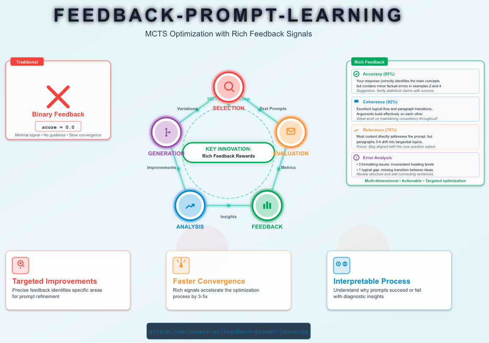

# Feedback-Prompt-Learning



> **Own your prompts. Define what you want. Let feedback drive the system.**

**Feedback-Prompt-Learning** is an open-source research framework for automatic prompt optimization using Monte Carlo Tree Search (MCTS) with feedback-driven gradient generation. This project critically examines PromptAgent's approach and proposes enhancements for more controllable, interpretable prompt optimization.

**🔬 Open Research Statement:** This is experimental research exploring the frontier of automatic prompt optimization. We provide transparent implementations of both PromptAgent's original approach and our feedback-enhanced variant to enable reproducible comparisons and community innovation.

______________________________________________________________________

## Philosophy: Eval-Driven Development

**Stop prompt engineering by trial-and-error.** Start with rigorous evaluation:

1. **Define what you want** - Write a reward function that captures your actual objectives
2. **Own your data** - Curate train/eval/test splits that reflect real-world usage
3. **Let feedback guide optimization** - The system learns from detailed feedback, not just scores
4. **Validate systematically** - Proper data separation ensures prompts generalize

This isn't about finding "the perfect prompt" through intuition. It's about **building a system** that measurably improves on your specific task.

______________________________________________________________________

## The Problem with PromptAgent

PromptAgent pioneered MCTS for prompt optimization, but has critical limitations:

### 1. **Blind Gradient Generation**

PromptAgent's gradient (prompt improvement direction) comes from analyzing *only error cases*:

- ✗ No visibility into **why** prompts succeeded
- ✗ Cannot reinforce effective patterns
- ✗ Loses information about prompt strengths
- ✗ Optimization becomes random walk in later iterations

**Result:** The algorithm cannot steer optimization toward desired characteristics. It only knows what's broken, not what to build.

### 2. **No Directional Control**

Without rich feedback, you cannot guide optimization toward specific objectives:

- ✗ Cannot enforce reasoning quality (step-by-step, chain-of-thought)
- ✗ Cannot optimize for style, tone, or format
- ✗ Cannot balance multiple objectives (accuracy + brevity + reasoning)
- ✗ Cannot incorporate domain constraints

**Result:** You get prompts that maximize accuracy but may be verbose, poorly structured, or miss important reasoning steps.

### 3. **Reward Signal Poverty**

Binary rewards (0.0 or 1.0) provide minimal learning signal:

- ✗ Two wrong answers get identical feedback (both 0.0)
- ✗ Cannot distinguish "close but wrong" from "completely off"
- ✗ Cannot detect partial credit or intermediate progress
- ✗ Gradient generation relies solely on error pattern matching

**Result:** Slow convergence, brittle optimization, difficulty escaping local optima.

______________________________________________________________________

## Our Approach: Feedback-Driven MCTS

We extend PromptAgent with **rich textual feedback** throughout the optimization loop:

### Key Innovation 1: Reward Functions with Feedback

Instead of returning just a score, reward functions return structured feedback:

**Structured Feedback Format:**

- `accuracy_feedback`: Why the answer was correct/incorrect
- `reasoning_feedback`: Quality of reasoning process (step-by-step, clarity, logic)
- `prompt_feedback`: How the prompt could be improved for this case

This feedback is injected into the gradient generation phase, giving the LLM critic concrete directions for improvement.

### Key Innovation 2: Balanced Example Sampling

Unlike PromptAgent (errors only), we sample from both successes and failures:

**Adaptive Sampling Strategy:**

- **High-performing prompts (reward > 0.7):** Sample more successes to reinforce what works
- **Low-performing prompts (reward \< 0.5):** Sample more errors to identify critical issues
- **Mid-range prompts:** Balanced mix to guide refinement

**Why this matters:**

- Learn from positive examples: "This reasoning pattern worked well"
- Avoid breaking strengths: "Don't lose the step-by-step structure that succeeded"
- Targeted improvements: "Keep X, but improve Y"

### Key Innovation 3: Feedback-Aware Gradient Generation

The gradient analysis prompt receives:

- Current prompt
- Performance trajectory (historical prompts + scores)
- **Sampled examples with detailed feedback** (not just errors)
- Success/failure distribution

The LLM critic generates gradients by:

1. **Analyzing patterns across successes AND failures**
2. **Identifying what to preserve** (from high-scoring examples)
3. **Diagnosing specific issues** (from detailed feedback)
4. **Proposing targeted improvements** (not random variations)

______________________________________________________________________

## Algorithmic Comparison

### PromptAgent (Baseline)

**MCTS Loop:**

1. Select promising node via UCT (Upper Confidence Bound for Trees)
2. Expand: Generate new prompts by analyzing **error cases only**
3. Simulate: Evaluate new prompts on validation set
4. Backpropagate: Update Q-values based on reward

**Gradient Generation:**

- Input: Current prompt + error examples
- Output: Generic improvement suggestion
- Limitation: No positive reinforcement, no directional control

### Feedback-MCTS (This Work)

**Enhanced MCTS Loop:**

1. Select promising node via UCT (same)
2. Expand: Generate new prompts using **balanced example sampling + detailed feedback**
3. Simulate: Evaluate on validation set (same)
4. Backpropagate: Update Q-values (same)

**Enhanced Gradient Generation:**

- Input: Current prompt + trajectory + balanced examples with rich feedback
- Output: Targeted improvement preserving strengths
- Benefit: Directional optimization toward defined criteria

**Key Difference:** The expansion phase has access to WHY prompts succeed/fail, enabling smarter gradient generation.

______________________________________________________________________

## Core Principles

### 1. **Evaluation First**

Define rigorous evaluation *before* optimizing:

- **Reward function** - What does "good" mean for your task? Return scores AND feedback
- **Data splits** - Train/eval/test that mirror production
- **Metrics** - Beyond accuracy (reasoning quality, format compliance, etc.)

Your data reflects your real-world distribution. Own it.

### 2. **Feedback > Scores**

Rich feedback enables smarter optimization:

- Diagnostic: Understand failure modes
- Prescriptive: Guide improvement direction
- Preservative: Maintain successful patterns

______________________________________________________________________

## Architecture

```
┌────────────────────────────────────────────────────────────────────┐
│                   MCTS Tree Search (Selection)                     │
│  • UCT formula balances exploration vs exploitation                │
│  • Track Q-values (average cumulative reward per node)             │
└────────────────────────────────────────────────────────────────────┘
                                   ▼
┌────────────────────────────────────────────────────────────────────┐
│                  Expansion: Generate Child Prompts                 │
│                                                                    │
│  PromptAgent Mode:           │   Feedback-MCTS Mode:              │
│  • Sample errors only        │   • Adaptive balanced sampling     │
│  • Analyze error patterns    │   • Rich feedback (accuracy +      │
│  • Generic gradient          │     reasoning + prompt advice)     │
│                              │   • Targeted gradient preserving   │
│                              │     strengths                      │
└────────────────────────────────────────────────────────────────────┘
                                   ▼
┌────────────────────────────────────────────────────────────────────┐
│              Simulation: Evaluate New Prompts on Eval Set          │
│  • Get reward from your custom reward function                    │
│  • Collect feedback for next iteration                            │
└────────────────────────────────────────────────────────────────────┘
                                   ▼
┌────────────────────────────────────────────────────────────────────┐
│            Backpropagation: Update Q-values Up Tree                │
│  • Cumulative reward flows from leaf to root                      │
│  • Update visit counts and Q-values                               │
└────────────────────────────────────────────────────────────────────┘
```

**Configuration:** Switch between PromptAgent and Feedback-MCTS via config:

- `configs/optimizer/mcts_promptagent.yaml`: Error-only baseline
- `configs/optimizer/mcts_feedback.yaml`: Feedback-enhanced variant

______________________________________________________________________

## Quick Start

### Basic Usage

Run prompt optimization on any BigBench task:

```bash
# Feedback-MCTS (multi-objective optimization)
uv run python ./feedback_prompt_learning/utils/eval_mcts.py \
  --method feedback \
  --dataset geometric_shapes

# PromptAgent (accuracy-only optimization)
uv run python ./feedback_prompt_learning/utils/eval_mcts.py \
  --method promptagent \
  --dataset epistemic

# Enable debug logging to see runtime prompt templates
uv run python ./feedback_prompt_learning/utils/eval_mcts.py \
  --method feedback \
  --dataset object_counting \
  --debug
```

### Available Datasets

All datasets configured in `configs/datasets.yaml`:

```bash
--dataset geometric_shapes   # Name shapes from SVG paths
--dataset casual_judgement   # Causal attribution reasoning
--dataset object_counting    # Count objects in scenes
--dataset epistemic          # Sentence entailment
--dataset penguins          # Table reasoning
```

### Custom Dataset

Add your dataset to `configs/datasets.yaml`:

```yaml
datasets:
  my_task:
    name: "my_task"
    description: "Task description"
    data_path: "dataset/my_task.json"
    init_prompt: "Initial instruction prompt"
    train_size: 100
    eval_size: 50
    test_size: 200
    seed: 42
    post_instruction: false
```

Then run:

```bash
uv run python ./feedback_prompt_learning/utils/eval_mcts.py \
  --method feedback \
  --dataset my_task
```

### Custom Reward Function with Feedback

Define a reward function that returns structured feedback:

```python
from feedback_prompt_learning.data import Feedback, RewardOutput


def my_reward_function(
    output: str, target: str, prompt: str, raw_output: str = ""
) -> RewardOutput:
    """
    Custom reward function with multi-objective feedback

    Args:
        output: Cleaned model output (after clean_response)
        target: Expected answer
        prompt: Current prompt being evaluated
        raw_output: Raw model response before cleaning

    Returns:
        RewardOutput with score and structured feedback
    """
    # 1. Check correctness
    is_correct = output.strip().lower() == target.strip().lower()
    accuracy = 1.0 if is_correct else 0.0

    # 2. Provide accuracy feedback
    if is_correct:
        accuracy_feedback = "Correct answer ✓"
    else:
        accuracy_feedback = f"Wrong answer: got '{output}' instead of '{target}'"

    # 3. Analyze reasoning quality (optional)
    reasoning_feedback = None
    if not is_correct and raw_output:
        if "step" in raw_output.lower():
            reasoning_feedback = (
                "Uses step-by-step reasoning but reached wrong conclusion"
            )
        else:
            reasoning_feedback = "Add explicit reasoning steps to improve accuracy"

    # 4. Evaluate prompt quality (optional)
    prompt_feedback = None
    if len(prompt) < 50:
        prompt_feedback = "Prompt is too brief - add more context and instructions"
    elif len(prompt) > 500:
        prompt_feedback = "Prompt is verbose - focus on essential instructions"

    # 5. Return structured feedback
    feedback = Feedback(
        accuracy_feedback=accuracy_feedback,
        reasoning_feedback=reasoning_feedback,
        prompt_feedback=prompt_feedback,
    )

    return RewardOutput(score=accuracy, feedback=feedback)
```

Then use it in your optimization:

```python
from feedback_prompt_learning.search_algo.mcts import MCTSPromptOptimizerFeedback
from feedback_prompt_learning.search_algo.world_model import (
    PromptOptimizationWorldModel,
)
from langchain_openai import ChatOpenAI

# Prepare your data
train_data = [("input1", "output1"), ("input2", "output2"), ...]
eval_data = [("input3", "output3"), ("input4", "output4"), ...]

# Initialize LLM
llm = ChatOpenAI(model_name="gpt-4o-mini", temperature=0.0)

# Create world model with your reward function
world_model = PromptOptimizationWorldModel(
    train_dataset=train_data,
    eval_dataset=eval_data,
    llm=llm,
    reward_fn=my_reward_function,
    clean_response_fn=lambda x: x.strip(),  # Your cleaning function
    minibatch_size_train=5,
    minibatch_size_eval=40,
    post_instruction=False,
)

# Run optimization
optimizer = MCTSPromptOptimizerFeedback(
    initial_prompt="Your initial instruction prompt",
    world_model=world_model,
)

await optimizer.run()

# Get best prompt
output = optimizer.prepare_output()
best_prompt = output["best_q_path"][-1].prompt
print(f"Optimized prompt: {best_prompt}")
```

______________________________________________________________________

## Research Questions & Open Problems

This framework enables empirical investigation of:

### 1. **Does Feedback Help?**

- Convergence speed: Feedback-MCTS vs PromptAgent
- Final performance: Best prompts found by each method
- Sample efficiency: Evaluations needed to reach target performance

### 2. **What Kind of Feedback Matters?**

- Accuracy feedback only vs reasoning feedback vs combined
- Prompt-level feedback vs example-level feedback
- Human-written feedback vs LLM-generated feedback

### 3. **Sampling Strategy Impact**

- Error-only vs balanced vs success-only sampling
- Static vs adaptive sampling based on node performance
- Optimal sample size and diversity

### 4. **Generalization vs Overfitting**

- Do feedback-optimized prompts generalize better?
- Train/eval/test performance gaps
- Robustness to distribution shift

**We provide both implementations to enable controlled experiments.** Results will vary by task, domain, and reward function design.

______________________________________________________________________

## Experimental Status & Limitations

**Current Limitations:**

- ⚠ No theoretical guarantees on convergence or optimality
- ⚠ Performance depends heavily on reward function design
- ⚠ LLM-generated gradients may be inconsistent or noisy
- ⚠ Computational cost: Each expansion requires multiple LLM calls
- ⚠ Limited to tasks where evaluation can be automated
- ⚠ Currently only OpenAI api is supported

______________________________________________________________________

## Performance Comparison

Performance across BigBench Hard tasks:

| Dataset              | Baseline      | PromptAgent       | Feedback-MCTS (General) | Feedback-MCTS (Memory-Enhanced) | Best Method           | Prompt Length                     |
| -------------------- | ------------- | ----------------- | ----------------------- | ------------------------------- | --------------------- | --------------------------------- |
| **geometric_shapes** | 0.601 ± 0.020 | 0.871 ± 0.022     | 0.869 ± 0.018           | 0.875 ± 0.018                   | **Feedback (+0.274)** | 503 ± 44 / 453 ± 87 / 585 ± 96    |
| **casual_judgement** | 0.588 ± 0.037 | 0.632 ± 0.011     | 0.660 ± 0.032           | 0.650 ± 0.049                   | **Feedback (+0.072)** | 270 ± 145 / 428 ± 105 / 400 ± 135 |
| **object_counting**  | 0.866 ± 0.028 | **0.969 ± 0.015** | 0.955 ± 0.022           | 0.962 ± 0.016                   | PromptAgent (+0.103)  | 135 ± 39 / 237 ± 45 / 355 ± 213   |
| **epistemic**        | 0.840 ± 0.005 | **0.886 ± 0.025** | 0.862 ± 0.016           | 0.877 ± 0.011                   | PromptAgent (+0.046)  | 187 ± 111 / 399 ± 89 / 325 ± 145  |
| **Average**          | 0.724         | 0.840             | 0.837                   | **0.841**                       | **Feedback (+0.117)** | N/A                               |

*Results over 5 runs.*

**Key Findings:**

- **Feedback-MCTS (Memory-Enhanced) is the best overall method** with highest average accuracy (0.841) and improvement (+0.117 over baseline)
- **Feedback-MCTS variants win on 2/4 tasks**, showing promise for multi-objective optimization
- **Feedback-MCTS wins on casual_judgement** (+0.072 over baseline) - a causal attribution task requiring multi-step reasoning about cause-effect relationships
- **Feedback-MCTS (Memory-Enhanced) wins on geometric_shapes** (+0.274 over baseline) with task-specific reward function that builds reasoning memory per option, enabling better spatial reasoning feedback
- **Prompt length**: PromptAgent produces shortest prompts (avg 273 tokens), Feedback-MCTS (General) (379 tokens), Feedback-MCTS (Memory-Enhanced) longest (416 tokens) with highest variance (±147), indicating more complex prompt structures
- All methods substantially improve over baseline across all tasks (+7.2 to +27.4 percentage points)

**Method Characteristics:**

- **PromptAgent**: Error-focused optimization, concise prompts optimized purely for accuracy

- **Feedback-MCTS**: Multi-objective optimization (accuracy + prompt structure + reasoning quality + length constraints), produces longer but more structured prompts with explicit reasoning steps
  **Why Feedback-MCTS (Memory-Enhanced) prompts are longest:**
  The memory-enhanced reward function adds reasoning pattern tracking:

- Builds semantic clusters of successful reasoning steps per answer option

- Provides targeted feedback based on missing or hallucinated reasoning patterns

- Encourages more detailed spatial/geometric analysis in prompts
  This results in 52% longer prompts than PromptAgent, with more explicit reasoning instructions.

______________________________________________________________________

## FAQ

**Q: Is feedback-driven MCTS always better than PromptAgent?**
A: Unknown. This is open research. We provide tools to test it on your tasks. Early experiments show promise, but results are task-dependent.

**Q: What if my task doesn't have clear correct answers?**
A: Define custom reward functions based on your criteria (coherence, relevance, style, etc.). The feedback mechanism is even more valuable for subjective tasks where you can articulate quality criteria.

**Q: Can I use this in production?**
A: Use the optimized prompts, not the optimization process itself. Run MCTS offline, validate the best prompt on your test set, then deploy it as a static prompt.

**Q: Why MCTS instead of other search algorithms?**
A: MCTS balances exploration (trying diverse prompts) and exploitation (refining good prompts). It's sample-efficient and handles large search spaces. But other algorithms (beam search, evolutionary methods, RL) could work too.

______________________________________________________________________

## Real-World Constraints: Style, Length, and Format

In production, you often need prompts that meet specific requirements beyond accuracy:

### Key Insight: Constraints Drive Business Value

In production:

- **Length limits** → Reduce API costs, improve latency, better UX
- **Style/tone** → Brand consistency, professionalism, compliance
- **Format** → Downstream integration, parsing reliability, automation
- **Content restrictions** → Legal compliance, safety, policy adherence

**The optimizer will find prompts that maximize quality WITHIN your constraints.**

______________________________________________________________________

## Contributing & Research Collaboration

This is open research. We welcome contributions in several areas:

### 1. **New Datasets & Evaluation Results**

Help expand the benchmark suite:

- **Add BigBench tasks**: More reasoning tasks (logical deduction, temporal reasoning, etc.)
- **Domain-specific tasks**: Medical QA, legal reasoning, code generation, creative writing
- **Multilingual evaluation**: Test prompt optimization across languages
- **Share your results**: Open PRs with evaluation results on new tasks (add to Performance Comparison table)

**How to contribute:**

1. Add dataset config to `configs/datasets.yaml`
2. Run both methods: `--method promptagent` and `--method feedback`
3. Report results with mean ± std over 5+ runs
4. Submit PR with dataset, config, and results

### 2. **Reward Function Library**

Share effective reward functions for different objectives:

- Task-specific feedback (math reasoning, coding, creative tasks)
- Multi-objective optimization (accuracy + brevity + style)
- Domain constraints (medical accuracy, legal compliance)
- Format enforcement (JSON, structured outputs)

### 3. **Code Quality & Refactoring**

Suggested improvements:

- **Type safety**: Add comprehensive type hints throughout codebase
- **Testing**: Unit tests for reward functions, sampling strategies, MCTS logic
- **Modularity**: Decouple feedback generation from reward calculation
- **Documentation**: Docstrings for all public APIs
- **Performance**: Optimize batch evaluation, parallel tree search
- **Configurability**: Make more hyperparameters configurable via YAML
- **LLM backends**: Add support for Anthropic, local models, other providers

### 4. **Algorithmic Research**

- Better sampling strategies (uncertainty-based, diversity-driven)
- Improved gradient generation prompts (meta-learning, few-shot examples)
- Alternative search algorithms (beam search, evolutionary, RL-based)
- Theoretical analysis (convergence properties, sample complexity)
- Transfer learning (reuse optimized prompts across similar tasks)

**Reproducibility Commitment:** All configurations, prompts, and experimental setups are version-controlled. We aim for full transparency in how algorithms behave.

______________________________________________________________________

## Citation

If you use this framework in your research, please cite:

```bibtex
@software{feedback_prompt_learning_2025,
  title={Feedback-Prompt-Learning: MCTS for Prompt Optimization with Rich Feedback},
  author={Oinar, Chingis},
  year={2025},
  url={https://github.com/cowana-ai/feedback-prompt-learning},
  note={Open-source research framework extending PromptAgent with feedback-driven optimization}
}
```

And please cite the original PromptAgent paper:

```bibtex
@article{wang2023promptagent,
  title={PromptAgent: Strategic Planning with Language Models Enables Expert-level Prompt Optimization},
  author={Wang, Xinyuan and Li, Chenxi and Wang, Zhen and Bai, Fan and Luo, Haotian and Zhang, Jiayou and Jojic, Nebojsa and Xing, Eric P and Hu, Zhiting},
  journal={arXiv preprint arXiv:2310.16427},
  year={2023}
}
```

______________________________________________________________________

## License

MIT License - See LICENSE file for details.

______________________________________________________________________

## Acknowledgments

This work builds on [PromptAgent](https://arxiv.org/abs/2310.16427) by Wang et al. We implement their approach faithfully and extend it with feedback mechanisms. Any improvements or limitations in our variant are our responsibility.

______________________________________________________________________

**Remember: Own your prompts. Define what you want. Let evaluation and feedback drive the system.**
